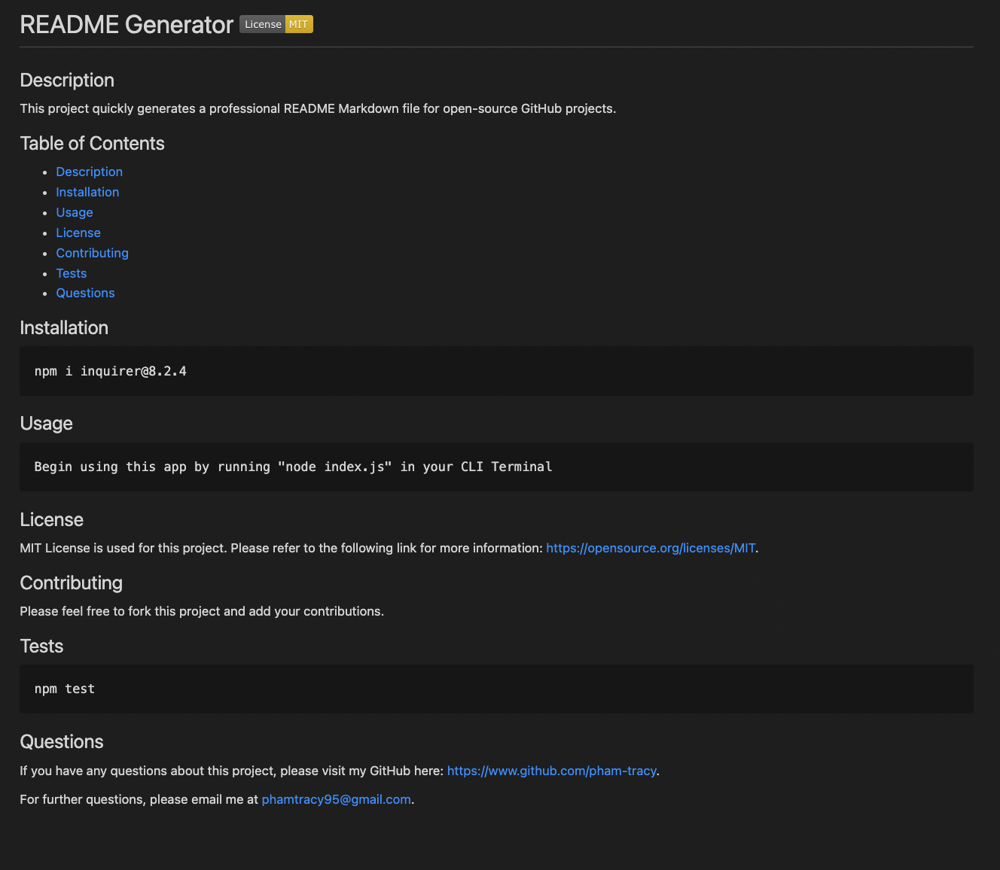

# README Generator

## Description

This command-line application helps users quickly generate a professional README Markdown file when creating an open source project on GitHub. This README includes information on what the application is, how to use, install, test and contribute to it, and which license it is covered by. It also provides contact information for any questions.

This application was created with JavaScript and Node.js. It also utilizes the FS and Inquirer packages.

## Installation

In order to use this application, you will need to install Inquirer version 8.2.4. To do so, you need to run the following command in your terminal:

     npm i inquirer@8.2.4

## Usage

In order to use this application, you will need to invoke it by running the following command in your terminal:

     node index.js

### Video Walkthrough

https://drive.google.com/file/d/13h9xUGh5trRO2bfBKpiXGByi_7p64Ipc/view

### Command Line Interface

### Sample README

## Credits

Starter code was provided by Coding-Boot-Camp: https://github.com/coding-boot-camp/potential-enigma.

License Badges were retrieved from GitHub user lukas-h at https://gist.github.com/lukas-h/2a5d00690736b4c3a7ba. Badges were created by https://Shields.io.

License Links were provided by https://opensource.org/licenses/gpl-license.

## License

MIT license is used for this project. Please refer to the LICENSE file in the repository for more details.
